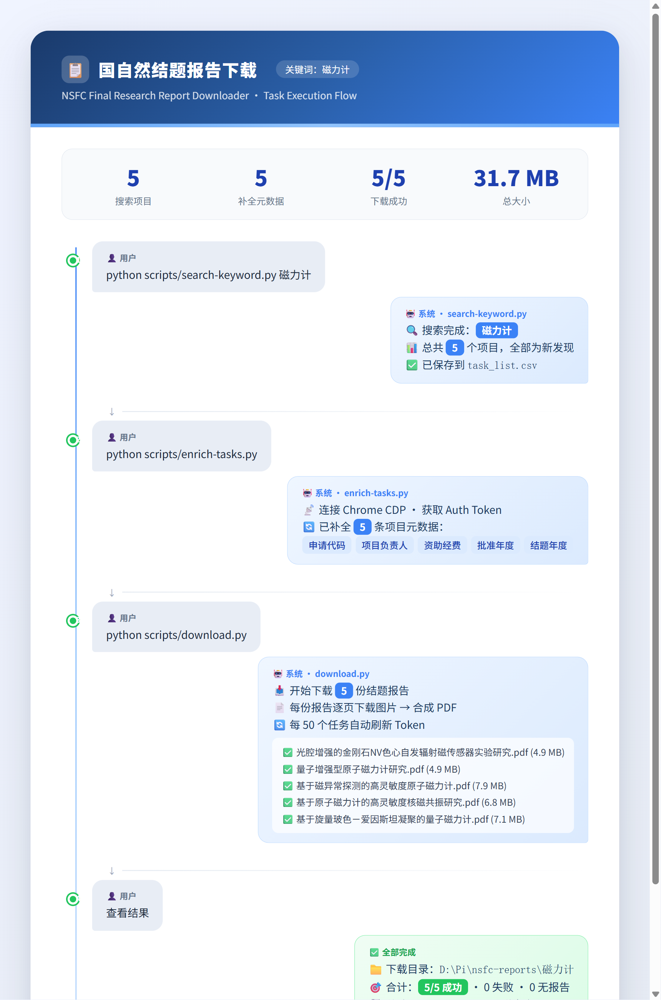

# NSFC Final Research Report Downloader / 国自然结题报告下载器

Automated tool for downloading final research reports (结题报告) from the
National Natural Science Foundation of China (NSFC / 国家自然科学基金) website
as PDF files.

国家自然科学基金结题报告自动化下载工具，将 kd.nsfc.cn 上的结题报告页面导出为完整 PDF。

> **Important / 重要**: You must have domain-specific research keywords (e.g. 电池, 电解质, 钙钛矿) to search and download reports. This tool does NOT support random browsing or keyword-free downloading.
> 
> **使用前必须有明确的研究领域关键词**（如：电池、电解质、电极材料、钙钛矿），该工具不支持无关键词的随机浏览或全站下载。

## Features / 功能

- Chrome CDP-based browser automation for authenticated access / 通过 Chrome DevTools Protocol 操控浏览器实现登录态访问
- Multi-dimensional search splitting (year, category, discipline, institution) / 多维度搜索拆分（年度→资助类别→学科→依托单位）
- Automatic image-to-PDF assembly from report pages / 自动将报告图片合成为 PDF
- Real-time task tracking with resume capability / 实时任务追踪，支持断点续传
- Rate-limit aware (built-in delays and retries) / 内置限流保护（自动延迟和重试）

## Prerequisites / 前置条件

- Python 3.8+
- Google Chrome installed / 已安装 Chrome 浏览器
- Your own NSFC account (manual login required due to captcha/biometric) / 自有 NSFC 账号（需手动输入验证码/指纹登录）

## Quick Start / 快速开始

```bash
# 1. Clone and install / 克隆并安装依赖
git clone https://github.com/maxuemx1988-hue/nsfc-download-plugin.git
cd nsfc-download-plugin
pip install -r requirements.txt

# 2. Configure / 配置
cp templates/config-example.py config.py
# Edit config.py with your keywords, Chrome path, and download directory
# 编辑 config.py，填写你的研究关键词、Chrome 路径和下载目录

# 3. Start Chrome and log in / 启动 Chrome 并登录
python scripts/start-chrome.py
# → Log into https://kd.nsfc.cn/ in the opened browser
# → 在打开的浏览器中登录 https://kd.nsfc.cn/

# 4. Search for projects / 搜索项目
python scripts/search-keyword.py "your keyword"

# 5. Enrich metadata / 补全项目元数据
python scripts/enrich-tasks.py

# 6. Download reports / 下载报告
python scripts/download.py
```

## Configuration / 配置说明

Copy `templates/config-example.py` to `config.py` and edit / 复制模板并编辑：

```python
KEYWORDS = ["your", "keywords"]          # 研究关键词
CHROME_PATH = r"C:\Program Files\Google\Chrome\Application\chrome.exe"
DOWNLOAD_DIR = r"D:\nsfc-reports"        # PDF 下载目录
```

Optional keyword lists for advanced search coverage / 可选高级搜索关键词列表：
- `SUB_KEYWORDS` — Fine-grained search terms / 细粒度搜索词
- `MATERIAL_KEYWORDS` — Material/component terms / 材料/组件相关词
- `COLD_KEYWORDS` — Long-tail supplemental terms / 长尾补充搜索词
- `RERUN_KEYWORDS` — Keywords to retry after Chrome restart / Chrome 重启后重试的关键词

All settings can be overridden via `NSFC_*` environment variables / 所有配置支持通过 `NSFC_*` 环境变量覆盖。

## Usage / 使用说明

### Search Scripts / 搜索脚本

| Script / 脚本 | Purpose / 用途 |
|--------|---------|
| `search-keyword.py [keyword]` | Main keyword search with year/category/discipline split / 主关键词搜索（年度→类别→学科拆分） |
| `search-sub-keywords.py` | Sub-keyword search with year/category split / 子关键词搜索（年度→类别拆分） |
| `search-material.py` | Material/component keyword search / 材料/组件关键词搜索 |
| `search-institution.py [keyword]` | Institution dimension search / 依托单位维度搜索 |
| `search-cold.py` | Cold/long-tail keyword supplemental search / 冷门关键词补充搜索 |
| `search-rerun.py` | Retry search after Chrome restart / Chrome 重启后重试 |
| `enrich-tasks.py` | Fetch project metadata from API / 从 API 补全项目元数据 |

All search results merge into `task_list.csv` with status tracking / 所有搜索结果合并到 `task_list.csv`，含状态追踪。



### Download / 下载

```bash
python scripts/download.py [--task-list path/to/task_list.csv]
```

Downloads all pending tasks, assembles report images into PDFs, and updates
task status in real time.

下载所有待处理任务，将报告图片合成为 PDF，实时更新任务状态。

## How It Works / 工作原理

1. **Chrome CDP** — Launches Chrome with remote debugging port, connects via
   WebSocket to control the browser and extract auth tokens / 
   启动 Chrome 远程调试端口，通过 WebSocket 控制浏览器并提取登录凭证

2. **Vue SPA Interaction** — The NSFC site is a Vue.js single-page app. The tool
   accesses Vue component state (`finalSearchList`) to read results and navigate
   pagination / 
   NSFC 网站是 Vue 单页应用，工具通过读取 Vue 组件状态来获取数据和翻页

3. **Multi-Dimensional Splitting** — NSFC limits results to 100 per query.
   The tool progressively splits by year, category, discipline, and institution
   to ensure complete coverage / 
   NSFC 每次搜索限 100 条结果，工具按年度、类别、学科、依托单位逐层拆分，确保全量覆盖

4. **API Download** — Uses the authenticated session to call NSFC APIs, download
   report page images, and assemble them into PDFs with Pillow / 
   通过认证会话调用 NSFC API，下载报告页图片，用 Pillow 合成 PDF

## Claude Code Integration / Claude Code 集成

This project includes a Claude Code skill. When opened in Claude Code, mention
"NSFC", "国自然", or "结题报告" to get AI-guided assistance with setup,
configuration, and troubleshooting.

本项目包含 Claude Code 技能文件。在 Claude Code 中提到"国自然"、"NSFC"、"结题报告"等关键词时，AI 将自动引导你完成安装、配置和故障排查。

## License / 许可证

MIT
